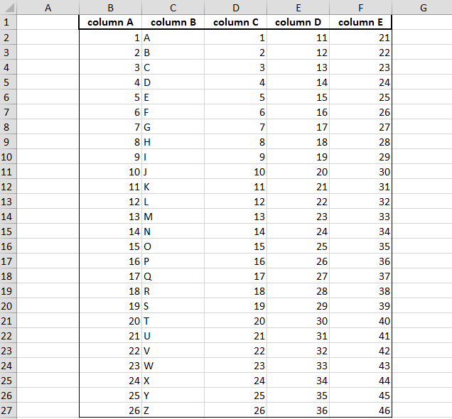

# tePLSQL
Template Engine for PLSQL.

tePLSQL is a template engine written completly in PL/SQL, generate text output (HTML web pages, e-mails, configuration files, source code, etc.) based on templates. Templates are written with embebed Dynamic PL/SQL . 

With tePLSQL you should prepare the data to display in your PL/SQL packages and do business calculations, and then the template displays that already prepared data. In the template you are focusing on how to present the data, and outside the template you are focusing on what data to present.

Now tePLSQL has the same syntax as the old fashion [Oracle PSP](http://docs.oracle.com/cd/E11882_01/appdev.112/e41502/adfns_psp.htm#ADFNS016) so you do not have to learn any new template language and your PSP will be supported by tePLSQL making some small modifications.

Templates are processed and a single block of PL/SQL code being executed dynamically, as does the Oracle PSP loader do.  

For a quick look see [basic example](#basic-example). The best example of use tePLSQL is [tapiGen2](https://github.com/osalvador/tapiGen2)

**topics**:

- [Prerequisites for developing and deploying tePLSQL templates](#prerequisites)
    + [Install](#install)
    + [Compatibility](#compatibility)
- [Developing tePLSQL templates](#developing)
    + [tePLSQL elements](#teElements)
    + [Specifying tePLSQL template characteristics](#characteristics)
    + [tePLSQL arguments](#arguments)
    + [Naming the tePLSQL templates](#naming)
    + [Including the contents of other template](#include)
    + [Declaring global variables in a tePLSQL template](#declare)
    + [Specifying executable statements in a tePLSQL template](#executable)
    + [Substituting expression values in a tePLSQL template](#expression)
    + [Escaping reserved words in a tePLSQL template](#escape)
    + [Print line break to the output](#lineBreak)
    + [Remove line break from the output](#noLineBreak)    
- [Loading and storing tePLSQL templates into the Database](#load)
- [Examples of tePLSQL templates](#examples)
- [Debugging tePLSQL templates](#debug)
- [tePLSQL API reference](#apiReference)
- [Advance Topics](#advance)
    + [tePLSQL Engine's Options](#engineOptions)
    + [Template Globbing](#templateGlobbing)
- [Contributing](#contributing)
- [License](#license)

<a name="prerequisites"></a>
## Prerequisites for developing and deploying tePLSQL templates
To develop and deploy tePLSQL templates, you must meet these prerequisites:

- To write a tePLSQL templates you need a text editor. No other development tool is required.
- To load a tePLSQL template you need an account on the database in which to load the templates.    
- To deploy tePLSQL template you must install tePLSQL package. 

<a name="install"></a>
### Install
Download and compile `TE_TEMPLATES.sql`,`TEPLSQL.pks` and `TEPLSQL.pkb`. No schema grants are necesary.

<a name="compatibility"></a>
###Compatibility
tePLSQL use regular expressions to process templates. Regular expressions were added in Oracle version 10 therefore teplsql works in Oracle Database 10g, 11g and 12c (all editions including XE).

<a name="developing"></a>
##Developing tePLSQL templates
The order and placement of the tePLSQL directives and declarations is usually not significant. It becomes significant only when another template is included. For ease of maintenance, we recommends that you put the directives and declarations near the beginning of the template.

The next table lists the tePLSQL elements and directs you to the section that explains how to use them. 

<a name="teElements"></a>
###tePLSQL elements

|Element | Name | Description | Section
|--------|------|------------- | ----
|`<%@ template key=value,key=value %>` | Template Directive | Characteristics of the template | [Specifying tePLSQL template characteristics](#characteristics)
|`${varName}` | Arguments | The arguments are defined in a key-value associative array that receives as parameter by the render | [tePLSQL arguments](#arguments)
|`<%@ include(...) %>` | Include Directive | Includes and evaluates the specified template | [Including the contents of other template](#include)
|`<%! ... %>` | Declaration block | The declaration for a set of PL/SQL variables that are visible throughout the template, not just within the next BEGIN/END block. | [Declaring global variables in a tePLSQL template](#declare)
|`<% ... %>` | Code block |A set of PL/SQL statements to be executed when the template is run. | [Specifying executable statements in a tePLSQL template](#executable)
|`<%= ... %>` | Expression block | A single PL/SQL expression | [Substituting expression values in a tePLSQL template](#expression)
|`\\` | Escaped character | Escaping reserved words like `<% .. %>` and `q'[]'` | [Escaping reserved words strings in a tePLSQL template](#escape)
| `\\n` | Line Break | Print line break to the output | [Print line break to the output](#lineBreak)
| `!\n` | Remove line break | Remove line break from the output | [Remove line break from the output](#noLineBreak)


<a name="characteristics"></a>
###Specifying tePLSQL template characteristics
Use the `<%@ template ... %>` directive to specify characteristics of the template:

- What is the name of the template, mandatory.
- Any other user-defined feature like version, date, author...

The characteristics are a pair of key-value separated by commas. 

Values defined in  `<%@ template ... %>` directive can be accessed anywhere in the template  as a variable argument, preceding the name of the key with the `template`.

#### Syntax

`<%@ template key=value, key2=value2 %>`

The syntax is case-sensitive but space-insensitive. Values with blanks are not allowed.

#### Example
```
<%@ template name=example_template, version=0.1 %>
Processing template ${template_name} with version ${template_version}
```

Output:
```
Processing template example_template with version 0.1
```

<a name="arguments"></a>
###tePLSQL arguments
The arguments variable are defined in Oracle PL/SQL associative array that receives as parameter by the render. Within the templates reference to ahce variables via `${varName}`.

#### Syntax
```plsql
DECLARE   
   p_vars       teplsql.t_assoc_array;
BEGIN   
   p_vars ('FullName') := 'Oscar Salvador Magallanes';
END;
```

#### Example
```plsql
DECLARE
   p_template   VARCHAR2 (32000);
   p_vars       teplsql.t_assoc_array;
BEGIN
   p_template  :='Hi ${FullName}!';
   
   p_vars ('FullName') := 'Oscar Salvador Magallanes';
   p_template  := teplsql.render (p_vars, p_template);
   DBMS_OUTPUT.put_line (p_template);
END;
```

Output:
```
Hi Oscar Salvador Magallanes
```

<a name="naming"></a>
###Naming the tePLSQL templates
In order to access and store templates correctly you must specify the template name in the `<%@ template ... %>` directive.

To specify a template name, use this directive, where tmpl is the name for the template:

    <%@ template name=tmpl %>

It is the name of the template, not the name of the object that you store the template. 

<a name="include"></a>
###Including the contents of other template
You can set up an include including other tePLSQL templates in the current template. Insert this directive at the point where the content of the other template is to appear, replacing template_name with the name of the template to be included. 

Any variables available in the current template are also available within the included template. However, all variables and functions defined in the included template have the local scope.

Nested includes are allowed. tePLSQL search the template and include it in a new DECLARE BEGIN END; block, which assigned its own scope. 

```
<%@ include(template1) %>
    --template1 include template2
    <%@ include(template2) %>    
      --template3 include template3
        <%@ include(template3) %>    
```

Will be interpreted as:
```plsql
DECLARE
BEGIN
--template1
    DECLARE
    BEGIN  
    --template2  
        DECLARE
        BEGIN
        --template3
        END;    
    END;
END;
```

#### Syntax
```   
   <%@ include(template_name, object_name, object_type, schema) %>
```

|Parameter | Description
| ---------| ------------
| `template_name` | The name of the template. Default NULL.
| `object_name`| The name of the object (usually the name of the package). Default TE_TEMPLATES table. 
| `object_type`| The type of the object (PACKAGE, PROCEDURE, FUNCTION...). Default PACKAGE.
| `schema`| The schema of the object. Default NULL.

You can use the include feature to pull in libraries of code into multiple templates. Alternatively, you can use this feature as a macro capability to include the same section of script code in multiple places in a template. 

#### Example
This example includes a footer template

    <%@ include (footer) %>

This template will be search into `TE_TEMPLATES` table. 

This is the same example, but the footer template is saved in package spec. 

    <%@ include(footer , tmpl_tab_api) %>

<a name="declare"></a>
###Declaring global variables in a tePLSQL template

You can use the `<%! ... %>` directive to define a set of tePLSQL variables that are visible throughout the template, not just within the next BEGIN/END block. This element typically spans multiple lines, with individual PL/SQL variable declarations ended by semicolons. 

You can specify multiple declaration blocks; internally, they are all merged into a single block.

You can also use explicit DECLARE blocks within the `<% ... %>` delimiters that are explained in "Specifying executable statements in a tePLSQL template". These declarations are only visible to the BEGIN/END block that follows them.

To make things easier to maintain, keep all your directives and declarations near the beginning of a PL/SQL server template.

#### Syntax
```plsql
<%! PL/SQL declaration;
    [ PL/SQL declaration; ] ... %>
```

The usual PL/SQL syntax is allowed within the block. The delimiters server as shorthand, enabling you to omit the DECLARE keyword. All declarations are available to the code later in the template.

#### Example
```plsql
<%!
  CURSOR emp_cursor IS
  SELECT last_name, first_name
  FROM hr.employees
  ORDER BY last_name;
%>
```

<a name="executable"></a>
###Specifying executable statements in a tePLSQL template
You can use the `<% ... %>` code block directive to run a set of PL/SQL statements when the template is run. 

This element typically spans multiple lines, with individual PL/SQL statements ended by semicolons. The statements can include complete blocks. 

The statements can also be the bracketing parts of IF/THEN/ELSE or BEGIN/END blocks. When a code block is split into multiple directives, you can put output text or other directives in the middle, and the middle pieces are conditionally executed when the template is run. The example provides an illustration of this technique.

All the usual PL/SQL syntax is allowed within the block.

#### Syntax
```plsql
<% PL/SQL statement;
   [ PL/SQL statement; ] ... %>
```

#### Example
```plsql
  <%! v_color VARCHAR2(20); %>
  <% FOR ITEM IN (SELECT product_name, list_price, catalog_url 
                  FROM product_information
                  WHERE list_price IS NOT NULL
                  ORDER BY list_price DESC) LOOP
     IF item.list_price > p_minprice THEN
        v_color := '#CCCCFF';
     ELSE
        v_color := '#CCCCCC';
     END IF;
  %>
  <TR BGCOLOR="<%= v_color %>">
    <TD><A HREF="<%= item.catalog_url %>"><%= item.product_name %></A></TD>
    <TD><BIG><%= item.list_price %></BIG></TD>
  </TR>
  <% END LOOP; %>
```

<a name="expression"></a>
###Substituting expression values in a tePLSQL template
An expression directive outputs a single PL/SQL expression, such as a string, arithmetic expression, function call, or combination of these things. The result is substituted as a string at that spot in the output that is produced by the template. The expression result must be a string value or be able to be cast to a string. For any types that cannot be implicitly cast, such as DATE, pass the value to the PL/SQL `TO_CHAR` function.

#### Syntax
The syntax of an expression directive is as follows, where the expression placeholder is replaced by the desired expression:

`<%= expression %>`

You need not end the PL/SQL expression with a semicolon.

#### Example
This example includes a directive to print the value of a variable in a row of a cursor:

`<%= emp_record.last_name %>`

The content within the `<%= ... %>` delimiters is processed by the `tePLSQL.P` procedure, which trims leading or trailing white space and requires that you enclose literal strings in single quotation marks.

You can use concatenation by using the twin pipe symbol (||) as in PL/SQL. This directive shows an example of concatenation:

`<%= 'The employee last name is ' || emp_record.last_name %>`


<a name="escape"></a>
###Escaping reserved words in a tePLSQL template
tePLSQL has three reserved words: 

  - `q'[]'`
  - `<%`
  - `%>`
  - `\\n`

tePLSQLP use `q'[]'` alternative quoting mechanism to print template text into buffer, and `<% %>` to define directives. 

If you want to escape this reserved words you must use `\\`.

#### Syntax

`\\reserved_word`  

#### Example
```
Scaping reserved words:
- q\\'[]\\'
- <\\%
- %\\>
- \\\\n
```

Output:
```
Scaping reserved words:
- q'[]'
- <%
- %>
- \\n
```

<a name="lineBreak"></a>
###Print line break to the output
The control of the white-space in a template is a problem that to some extent haunts every template engine in the business.

tePLSQL use white-space stripping. It automatically ignores (i.e. does not print to the output) superfluous white-spaces. The indentation white-space, and trailing white-space at the end of the line (includes the line break) will be ignored in lines that contains only tePLSQL tags (e.g. `<%if ... %>`, `<%! ... %>`), apart from the ignored white-space itself. 

If you want to force insert a line break you can use `\\n`

#### Syntax

`\\n`  

#### Example
Without `\\n` 
```
<% for i in 1 .. 10 loop %>
Value: <%=i%>
<%end loop;%>
```

```
Value: 1Value: 2Value: 3Value: 4Value: 5Value: 6Value: 7Value: 8Value: 9Value: 10
```

With `\\n`
```
<% for i in 1 .. 10 loop %>
Value: <%=i%>\\n
<%end loop;%>
```

```
Value: 1
Value: 2
Value: 3
Value: 4
Value: 5
Value: 6
Value: 7
Value: 8
Value: 9
Value: 10
```

<a name="noLineBreak"></a>
###Remove line break from the output
By the same way you can indicate in the template that a line break is not printed on the output. 

#### Syntax

`!\n`  

#### Example
Without `!\n` 
```
Values:
<% for i in 1 .. 10 loop %>
<%=i%>,
<%end loop;%>
```

```
Values:
1,
2,
3,
4,
5,
6,
7,
8,
9,
10,
```

With `!\n`
```
Values:!\n
<% for i in 1 .. 10 loop %>
<%=i%>,!\n
<%end loop;%>
```

```
Values:1,2,3,4,5,6,7,8,9,10,
```

<a name="load"></a>
##Loading and storing tePLSQL templates into the Database
You can store tePLSQL templates in the database in two ways: In the relational table `TE_TEMPLATES` or in any Oracle Object.

###TE_TEMPLATES table
`TE_TEMPLATES` table Is the default way of storing a tePLSQL templates. The table has a `TEMPLATE` column defined as CLOB where the template is loaded. 

#### Syntax

```
TABLE TE_TEMPLATES
 Name                                      Null?    Type                        
 ----------------------------------------- -------- ----------------------------
 NAME                                      NOT NULL VARCHAR2(300)               
 TEMPLATE                                           CLOB                        
 DESCRIPTION                                        VARCHAR2(300)               
 CREATED_BY                                NOT NULL VARCHAR2(100)               
 CREATED_DATE                              NOT NULL DATE                        
 MODIFIED_BY                               NOT NULL VARCHAR2(100)               
 MODIFIED_DATE                             NOT NULL DATE 
```

#### Example
Insert template named *adding* into `TE_TEMPLATES` table
```plsql
INSERT INTO te_templates (name
                        , template)
  VALUES   ('ADDING'
          , '<%@ template 
    name=adding,
    version=0.1 %>
<%! x pls_integer := 1 + 1; %>
Processing template ${template_name} with version ${template_version}
The variable x has the value: <%= x %>');

COMMIT;
```

Processing the template: 
```plsql
SET SERVEROUTPUT on;
BEGIN
   DBMS_OUTPUT.put_line (teplsql.process (p_template_name => 'adding'));
END;
```

Output
```
Processing template adding with version 0.1
The variable x has the value: 2
```

###Oracle Objects

tePLSQL templates can be stored inside PL/SQL program unit spec or bodies.

In order to place a template into a program unit you have to create a non-compiled section in the latter with the aid of PL/SQL conditional compilation directives:

####Syntax
```
$if false $then
... template ...
$end
```

The syntax is case-sensitive but space-insensitive. Line breaks are not allowed. 

####Example

```plsql
CREATE OR REPLACE PACKAGE test_tmpl
AS
$if false $then
<%! x pls_integer := 1 + 1; %>
The variable x has the value: <%= x %>
$end
END test_tmpl;
```

Process the template:

```plsql
SET SERVEROUTPUT on;
BEGIN
   DBMS_OUTPUT.put_line (teplsql.process (p_object_name => 'test_tmpl'));
END;
```

Outout:
```
The variable x has the value: 2
```

####Anonymous  templates
An anonymous template must be the only template in its host object. The template resides in a non-compiled section and occupies it entirely. An example of an anonymous template placed in the `test_tmpl` package specification:

```plsql
CREATE OR REPLACE PACKAGE test_tmpl
AS
$if false $then
<%! x pls_integer := 1 + 1; %>
The variable x has the value: <%= x %>
$end
END test_tmpl;
```

tePLSQL seeks anonymous templates in objects greedily, so the following template contains two anonymous templates that tePLSQL merge and execute together.

```plsql
create or replace package test_tmpl2 as
$if false $then
<%! x pls_integer := 1 + 1;%>
Value X: <%= x %>
$end

$if false $then
<%! y pls_integer := 2 + 3; %>
Value Y: <%= y %>
$end
end test_tmpl2;
/
```

tePLSQL interpret it as:
```plsql
<%! x pls_integer := 1 + 1;%>
Value X: <%= x %>
<%! y pls_integer := 2 + 3; %>
Value Y: <%= y %>
```

Process the template:
```plsql
SET SERVEROUTPUT on;
BEGIN
   DBMS_OUTPUT.put_line (teplsql.process (p_object_name => 'test_tmpl2'));
END;
```

Output:
```
Value X: 2Value Y: 5 
```

####Named
In order to store several templates in a single object correctly you must
specify template characteristics, giving the name of the template.

Defining the template name

```plsql
CREATE OR REPLACE PACKAGE test_tmpl
AS

$if false $then
<%@ template 
    name=adding,
    version=0.1 %>
<%! x pls_integer := 1 + 1; %>
Processing template ${template_name} with version ${template_version}
The variable x has the value: <%= x %>
$end

$if false $then
<%@ template name=subtracting, version=0.1, revision=3 %>
<%! y pls_integer := 1 - 1; %>
Processing template ${template_name} with version ${template_version} and revision ${template_revision}
The variable y has the value: <%= y %>
$end

END test_tmpl;
```

Process the "subtracting" template:

```plsql
SET SERVEROUTPUT on;
BEGIN
   DBMS_OUTPUT.put_line (teplsql.process (p_template_name => 'subtracting', p_object_name => 'test_tmpl'));
END;
```

Output:

    Processing template subtracting with version 0.1 and revision 3
    The variable y has the value: 0

<a name="examples"></a>
##Examples of tePLSQL templates

### Basic Example

```plsql
DECLARE
   p_template   VARCHAR2 (32000);
   p_vars       teplsql.t_assoc_array;
BEGIN
   p_template  :=
      q'[<%/* Using variables */%>
       Hi ${FullName}!

       <%/* Using expressions */%>
       Today <%= TO_CHAR(SYSDATE, 'DD-MM-YYYY') %> is a great day!
              
       <% --Using external variable in the query loop
          for c1 in (select username, user_id from all_users where username = upper('${username}')) loop %>          
       Username: <%= c1.username %>, ID:<%= c1.user_id %>.
       <% end loop; %>       
       
       <%/* Escaping chars */%>       
       This is the tePLSQL code block syntax <\\% ... %\\>
              
       <%/* Regards */%>
       Bye <%=UPPER('${username}')%>.]';

   --Key-value variables.
   p_vars ('FullName') := 'Oscar Salvador Magallanes';
   p_vars ('username') := 'test';

   p_template  := teplsql.render (p_vars, p_template);

   DBMS_OUTPUT.put_line (p_template);
END;
```

Output:
```
    Hi Oscar Salvador Magallanes!
    
    Today 08-09-2015 is a great day!
    
    Username: SYS
    
    This is the tePLSQL code block syntax <% ... %>
    
    Bye SYS.

    PL/SQL procedure successfully completed.
    Elapsed: 00:00:00.02
```

### HTML Example
```plsql
DECLARE
   p_template   CLOB;
   p_vars       teplsql.t_assoc_array;
BEGIN
   p_template  :=
      q'[<!DOCTYPE html>
    <html>
      <head>
        <title>${title}</title>
      </head>
      <body>
        <h1> Print Sequence numbers </h1>
        <br>
        <%for i in ${initValue} .. ${lastValue} loop %>
        <%= i %><br>
        <% end loop;%>
        <h1> Print the Odd numbers of sequence </h1>
        <br>    
        <% /*You can insert PLSQL comments as always*/ 
        for i in ${initValue} .. ${lastValue}
        loop 
            if mod(i,2) <> 0 
            then %>
        <%= i %><br>
        <% end if; 
        end loop; %>
      </body>
    </html>]';

   --Key-value variables.
   p_vars ('title') := 'Number sequence';
   p_vars ('initValue') := 5;
   p_vars ('lastValue') := 20;

   p_template  := teplsql.render (p_vars, p_template);

   DBMS_OUTPUT.put_line (p_template);
END;
```

Output: 
```html
<!DOCTYPE html>
    <html>
      <head>
        <title>Number sequence</title>
      </head>
      <body>
        <h1> Print Sequence numbers </h1>
        <br>
        5<br>
        6<br>
        7<br>
        8<br>
        9<br>
        10<br>
        11<br>
        12<br>
        13<br>
        14<br>
        15<br>
        16<br>
        17<br>
        18<br>
        19<br>
        20<br>
        <h1> Print the Odd numbers of sequence </h1>
        <br>    
        5<br>
        7<br>
        9<br>
        11<br>
        13<br>
        15<br>
        17<br>
        19<br>
      </body>
    </html>
    PL/SQL procedure successfully completed.
    Elapsed: 00:00:00.02
```

### Excel example
Generating formatted Excel file. Save the result as .xml file and open it with MS Excel.

```plsql
set timing on;
set serveroutput on;

DECLARE
   p_template   CLOB;
   p_vars       teplsql.t_assoc_array;
BEGIN
   p_template  :=
      q'[<?xml version="1.0"?>
<?mso-application progid="Excel.Sheet"?>
<Workbook xmlns="urn:schemas-microsoft-com:office:spreadsheet"
 ...
   <% for i in 1 .. 26 loop%>
   <Row ss:AutoFitHeight="0">
    <Cell ss:Index="2" ss:StyleID="s65"><Data ss:Type="Number"><%=i%></Data></Cell>
    <Cell ss:StyleID="s66"><Data ss:Type="String"><%=CHR (i + 64)%></Data></Cell>
    <Cell ss:StyleID="s66"><Data ss:Type="Number"><%=i%></Data></Cell>
    <Cell ss:StyleID="s66"><Data ss:Type="Number"><%=i+10%></Data></Cell>
    <Cell ss:StyleID="s67"><Data ss:Type="Number"><%=i+20%></Data></Cell>
   </Row> 
   <% end loop; %>
 ...
</Workbook>]';

   p_template  := teplsql.render (p_vars, p_template);

   DBMS_OUTPUT.put_line (p_template);
END;
```

Output:



#### Declaration and instructions

```plsql
DECLARE
   p_template   CLOB;
   p_vars       teplsql.t_assoc_array;
BEGIN
   p_template  := 
   q'[<%! lang_name VARCHAR2(10) := 'PL/SQL';
       l_random_number pls_integer := ROUND(DBMS_RANDOM.VALUE (1, 9));
      %> 
        The 'sequence' is used in scripting language: <%=lang_name %>.            
        The result of the operation ${someInValue} * <%= l_random_number %> is <%= ${someInValue} * l_random_number %>
    ]';

   --Key-value variables.   
   p_vars ('someInValue') := 5;   

   p_template  := teplsql.render (p_vars, p_template);

   DBMS_OUTPUT.put_line (p_template);
END;
```

Output:

        The 'sequence' is used in scripting language: PL/SQL.
        The result of the operation 5 * 7 is 35

<a name="debug"></a>
##Debugging tePLSQL templates
As you begin experimenting with tePLSQL templates, and as you adapt your first simple templates into more elaborate ones, keep these guidelines in mind when you encounter problems. 

###Find where the template fails
tePLSQL interprets the template and converts it into executable PL/SQL code. When error is occurred you will see the description in the `DBMS_OUTPUT`:

Rendering this template: 
```
Testing Error. 
<%/* Raising error "divisor is equal to zero" */%>
Raising an error <%= 10/0 %>.
```

You will get this error:
```
Testing Error. 
Raising an error ### tePLSQL Render Error ###
ORA-01476: divisor is equal to zero ORA-06512: at line 2
ORA-06512: at "USER.TEPLSQL", line 666

### Processed template ###
DECLARE  BEGIN tePLSQL.p(q'[Testing Error. 
]'); /* Raising error "divisor is equal to zero" */ tePLSQL.p(q'[Raising an error ]');tePLSQL.p( 10/0 );tePLSQL.p(q'[. ]'); END;
```

`### Processed template ###` is the template converted into executable PL/SQL.

You can see `ORA-01476: divisor is equal to zero ORA-06512: at line 2` means that in the second line of the `### Processed template ###` code you have the error. 

The exception message will be append into the tePLSQL buffer. This helps you to find where the exception is occurred. tePLSQL trunc the buffer at maximum 500 characters to prevent the exception message is truncated in long templates.

####Syntax error
Rendering this template:
```
Testing syntax Error. 
<%/* Raising syntax error */%>
Raising an error <%= 10/1; %>.
```

You will get this error:
```
### tePLSQL Render Error ###
ORA-06550: line 2, column 82:
PLS-00103: Encountered the symbol ";" when expecting one of the following:

   ) , * & = - + < / > at in is mod remainder not rem =>
   <an exponent (**)> <> or != or ~= >= <= <> and or like like2
   like4 likec as between from using || member submultiset
The symbol ";" was ignored. ORA-06512: at "DBAX.TEPLSQL", line 666

### Processed template ###
DECLARE  BEGIN tePLSQL.p(q'[Testing syntax Error. 
]'); /* Raising syntax error */ tePLSQL.p(q'[Raising an error ]');tePLSQL.p( 10/1; );tePLSQL.p(q'[. ]'); END;
```

You will see at line 2 column 82, this instruction `tePLSQL.p( 10/1; )` that is not valid in PL/SQL. 

<a name="apiReference"></a>
##tePLSQL API reference

### RENDER

Renders the template received as parameter. 

#### Syntax

```plsql
FUNCTION render (p_vars IN t_assoc_array DEFAULT null_assoc_array,p_template IN CLOB)
  RETURN CLOB;
```

#### Parameters

|Parameter | Description
|----------|------------
|p_vars | The template's arguments.
|p_template | The template's body.
| return CLOB | The processed template.

### PROCESS

Rceives the name of the object, usually a package, which contains an embedded template. The template is extracted and is rendered with `render` function 

#### Syntax

```plsql
FUNCTION process (p_vars            IN t_assoc_array DEFAULT null_assoc_array
                , p_template_name   IN VARCHAR2 DEFAULT NULL
                , p_object_name     IN VARCHAR2 DEFAULT 'TE_TEMPLATES'                                      
                , p_object_type     IN VARCHAR2 DEFAULT 'PACKAGE'
                , p_schema          IN VARCHAR2 DEFAULT NULL )
```

#### Parameters

|Parameter | Description
|----------|------------
|p_vars | The template's arguments.
|p_template_name | The name of the template.
|p_object_name | The name of the object (usually the name of the package).
|p_object_type | The type of the object (PACKAGE, PROCEDURE, FUNCTION...).
|p_schema | The object's schema name.
| return CLOB | The processed template.

### PRINT

Prints received data into the buffer

#### Syntax

```plsql
PROCEDURE PRINT (p_data IN CLOB);

PROCEDURE p (p_data IN CLOB);

PROCEDURE PRINT (p_data IN VARCHAR2);

PROCEDURE p (p_data IN VARCHAR2);

PROCEDURE PRINT (p_data IN NUMBER);

PROCEDURE p (p_data IN NUMBER);
```

#### Parameters

|Parameter | Description
|----------|------------
|p_data | The data to print into buffer


### OUTPUT_CLOB

Output CLOB data to the DBMS_OUTPUT.PUT_LINE

#### Syntax

```plsql
PROCEDURE output_clob(p_clob in CLOB);
```

#### Parameters

|Parameter | Description
|----------|------------
|p_clob | The CLOB to print to the DBMS_OUTPUT

<a name="advance"></a>
## Advance Topics

<a name="engineOptions"></a>
### tePLSQL Engine Options
The way that the tePLSQL engine behaves can be modified by adding the options as additional [tePLSQL arguments](#arguments).
The settings are reset to DEFAULT values, prior to parsing Template Variables, for each run.

The argument names are defined as constants within the tePLSQL package specification.

|Constant |Valid Values |Default Value |Description
|---------|-------------|--------------|-------------
|g_set_max_includes | integers >0 | 50 | [sets the maximum number of `include`](#maxInclude)
|g_set_globbing_mode | constants `g_globbing_mode_*` | off | sets the search mode for [Template Globbing](#templateGlobbing).
|g_set_globbing_separator | any valid string | `chr(10)` | The string used between globbed templates.  More information is [here](#templateSeparator)


<a name="maxInclude"></a>
#### g_set_max_includes
In order to prevent potential infinite loops, tePLSQL will stop after processsing a set number of `include` commands.

The default value is set to `50`.  This value can be addjust with the `g_set_max_includes` argument.

```sql
DECLARE
  l_vars  teplsql.t_assoc_array := teplsql.null_assoc_array;
BEGIN
  -- normal template variables
  l_vars('schema')  := USER;
  l_vars('table_name') := 'MY_TABLE';

  -- setting maximum number includes to 100
  l_vars(teplsql.g_set_max_includes)  := 100;

  l_result := teplsql.process(l_vars,'My TAPI Template');
END;
/
```

<a name="templateGlobbing"></a>
### Template Globbing
Template Globbing allows a developer to include multiple templates with a single `include` call.  By default, this feature is `off`.

When used, the templates that match the search string are returned in case-sensitive order separated by a predetermined string.

Example template for generating the Package Specification
```sql
create or replace
package <%@ include( com.mycompany.templates.tapi.main_pkg.name ) %>
as
  <%@ include( com.mycompany.templates.tapi.main_pkg.documentation ) %>
  
  <%@ include( com.mycompany.templates.tapi.main_pkg.functions.*.specification ) %>
end <%@ include( com.mycompany.templates.tapi.main_pkg.name ) %>;
<%= '/' %>
```

Template Globbing will expand as if the template was defined like this.
```sql
create or replace
package <%@ include( com.mycompany.templates.tapi.main_pkg.name ) %>
as
  <%@ include( com.mycompany.templates.tapi.main_pkg.documentation ) %>
  
  <%@ include( com.mycompany.templates.tapi.main_pkg.functions.01_ins.specification ) %>
  <%@ include( com.mycompany.templates.tapi.main_pkg.functions.02_upd.specification ) %>
  <%@ include( com.mycompany.templates.tapi.main_pkg.functions.03_del.specification ) %>
  <%@ include( com.mycompany.templates.tapi.main_pkg.functions.04_sel.specification ) %>
  <%@ include( com.mycompany.templates.tapi.main_pkg.functions.05_hash.specification ) %>
end <%@ include( com.mycompany.templates.tapi.main_pkg.name ) %>;
<%= '/' %>
```

If other similarly named templates are created, they will be automatically included the next time the Package Specification template is used.

#### Engine Options
##### Enabling Template Globbing
The constant `teplsql.g_set_globbing_mode` defines the name of the Template Variable the determines the Template Globbing mode.

| constant | description |
|----------|-------------|
| `teplsql.g_globbing_mode_off` | Template Globbing mode is disabled (default) |
| `teplsql.g_globbing_mode_on` | Template Globbing mode is on.  Search is case-sensitive.  The star ( `*` ) is the only supported wildcard.  Wildcard expansion will not expand across dots( `.` ). |
| `teplsql.g_globbing_mode_regexp` | Template Globbing mode is on.  The template name within in the `include` clause is used as-is for a case-sensitive Regular Expression search. |
| `teplsql.g_globbing_mode_like` | Template Globbing mode is on.  The template name within the `include` clause is used as-is for a case-insensitve LIKE search. |

Before each call to `process` or `render`, you need to set the required Template Variable.
```sql
  -- Turn on Template Globbing
  p_vars( teplsql.g_set_globbing_mode ) := teplsql.g_globbing_mode_on;
  -- Default value for templates that use globbing can be too small
  p_vars( teplsql.g_set_maximum_includes ) := 150;
```

<a name="templateSeparator"></a>
##### Separation String
The concatination string used between included templates can be set with the Template Variable name defined by `teplsql.g_set_globing_separator`.

By default, this string is `chr(10)`.

Example
```sql
  -- all globbed templates are separated by a single 80 column block comment line.
  p_vars( teplsql.g_set_globbing_separator ) := chr(10) || '/' || lpad('*',78,'*') || '/' || chr(10);
```

<a name="contributing"></a>
## Contributing

If you have ideas, get in touch directly.

Please inser at the bottom of your commit message the following line using your name and e-mail address .

    Signed-off-by: Your Name <you@example.org>

This can be automatically added to pull requests by committing with:

    git commit --signoff

<a name="license"></a>
## License
Copyright 2015 Oscar Salvador Magallanes 

tePLSQL is under MIT license. 
